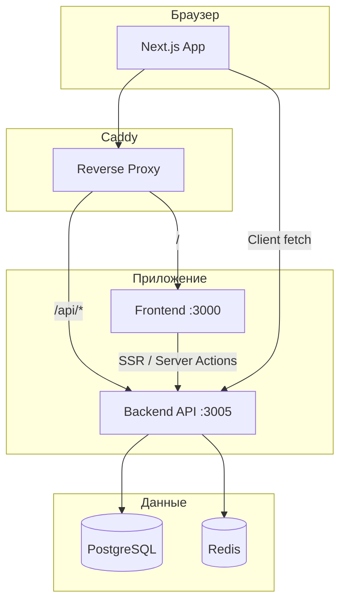

# ✍️ IT Blog

Платформа для публикации IT-статей: лента, редактор, профили авторов, комментарии и поиск. Fullstack-пет-проект с разделением на API и SPA-подобный фронтенд на Next.js, готовый к деплою в Docker.

[](https://nextjs.org/)
[](https://react.dev/)
[](https://www.typescriptlang.org/)
[](https://expressjs.com/)
[](https://www.postgresql.org/)
[](https://www.prisma.io/)
[](https://redis.io/)
[](https://docs.docker.com/compose/)

---

## Содержание

- [О проекте](#-о-проекте)
- [Что сделано](#-что-сделано)
- [Планы по развитию](#-планы-по-развитию)
- [Что можно было сделать лучше](#-что-можно-было-сделать-лучше)
- [Быстрый старт](#-быстрый-старт)
- [Архитектура](#архитектура)
- [Структура репозитория](#-структура-репозитория)
- [Переменные окружения](#-переменные-окружения)
- [Скрипты](#-скрипты)

---

## О проекте

Demo: https://alexnel.ru

**IT Blog** — полнофункциональный fullstack pet-проект, созданный для изучения современной frontend- и backend-разработки. Основной акцент сделан на архитектуре клиентской части, работе с Server Components, SEO, редактором статей и организации приложения по Feature-Sliced Design.

Frontend:
Next.js • React • TypeScript • Tailwind CSS • TanStack Query • Zustand • TipTap • React Hook Form • Zod

Backend:
Node.js • Express • Prisma • PostgreSQL • Redis • JWT • Docker Compose • Caddy

---

## Что сделано

### Продукт

- Двухшаговый редактор статей: написание контента → настройки, превью и публикация.
- Rich-text на TipTap с toolbar, загрузкой изображений и редактором обложки поста.
- Лента с пагинацией, сортировкой, фильтрами и страницами поиска и тегов.
- Страница поста с голосованием, счётчиком просмотров и древовидными комментариями.
- Публичные профили по `username`: посты, комментарии, «О себе», подписки и список связей.
- Регистрация и вход по email или username; настройки аккаунта, профиля и безопасности.
- Смена пароля и username, генерация nickname при регистрации.

### Frontend

- Next.js 16 App Router с Server Components, streaming UI и route-level `loading` / `error`.
- Организация кода по Feature-Sliced Design: `entities` → `features` → `widgets` → `views`.
- TanStack Query для клиентских запросов и server-side fetching для SSR-страниц.
- Кеширование через `cacheTag` / `cacheLife` и инвалидация через server actions после мутаций.
- JWT-сессия: refresh-интерцептор, `UserProvider` и единый HTTP-клиент для browser и server.
- Формы на React Hook Form + Zod с маппингом серверных ошибок в поля.
- Переиспользуемый TipTap-редактор в `shared/ui` — и для статей, и для комментариев.
- Prefetch ссылок при наведении (`HoverPrefetchLink`) в меню и ленте.
- Typed routes, `cacheComponents`, standalone-сборка для Docker.

### Backend

- REST API на Express + TypeScript с модульной структурой: routes → controller → service → Prisma.
- Prisma ORM, миграции и seed; snake_case в PostgreSQL через `@map`.
- JWT access + refresh-токены; middleware авторизации и роли USER / MODERATOR / ADMIN.
- CRUD постов со slug, категориями, тегами, черновиками и валидацией через Zod.
- Голосование за посты и комментарии; древовидные комментарии с редактированием и удалением.
- Профили и подписки; rate limit на follow/unfollow и чувствительные мутации.
- Подсчёт просмотров через Redis с TTL — без накрутки при повторных заходах.
- Загрузка изображений с полными URL; SEO-эндпоинт для данных sitemap.
- `BaseRepository`, `asyncHandler`, централизованная обработка ошибок и валидация env при старте.

### DevOps

- Docker Compose для dev и prod: PostgreSQL, Redis, backend, frontend, Caddy с HTTPS.
- Автоматические миграции Prisma при старте контейнера; корневые npm-скрипты для всего стека.
- Caddy как reverse proxy: фронт на `/`, API на `/api/*`.

### SEO

- Динамические `metadata` и Open Graph для постов и профилей.
- `sitemap.xml`, `robots.txt`, `manifest`; серверная генерация карты сайта из API.

---

## Планы по развитию

- добавить восстановление пароля;
- добавить систему уведомлений (WebSocket / SSE);
- реализовать загрузку аватаров и обложек профиля;
- вынести административную панель в отдельный сервис для управления статьями и модерации;
- добавить подсветку комментария при переходе из профиля к статье;
- добавить плавные анимации интерфейса;
- реализовать подтверждение и смену адреса электронной почты;
- добавить вход через Github.

## 💭 Что можно было сделать лучше

Этот проект разрабатывался как площадка для изучения современных технологий и архитектурных подходов. По мере роста проекта менялось и мое понимание того, как следует организовывать код. Поэтому некоторые части приложения отражают разные этапы моего обучения.

Основные ошибки, которые я допустил:

- начал разрабатывать frontend и backend одновременно, из-за чего контракты API неоднократно менялись;
- сразу приступил к реализации интерфейса и новых возможностей, не заложив архитектурный фундамент проекта;
- по мере роста backend появились неоднородные архитектурные решения: в одних модулях используется Repository Pattern, в других бизнес-логика находится непосредственно в сервисах;
- из-за отсутствия единого подхода в начале разработки в некоторых местах появилось дублирование кода и различия в организации модулей.

Я сознательно не планирую полностью переписывать этот проект, так как он уже был переписан несколько раз и на него ушло не мало времени. Для меня он является отражением моего опыта и показывает, как менялось понимание архитектуры в процессе разработки.

Вместо полного рефакторинга я предпочитаю использовать полученный опыт в следующих проектах, где все эти ошибки будут учтены с самого начала. Поэтому этот репозиторий стоит воспринимать не только как демонстрацию реализованного функционала, но и как показатель моего профессионального роста.

## 🚀 Быстрый старт

### Требования

- [Docker](https://www.docker.com/) и Docker Compose (встроен в Docker Desktop)

### 1. Запуск

Из корня репозитория:

```bash
npm run dev
```

Docker Compose поднимет все сервисы:

| Сервис      | Адрес                     |
| ----------- | ------------------------- |
| Frontend    | http://localhost:3000     |
| Backend API | http://localhost:3005/api |
| PostgreSQL  | `localhost:5432`          |
| Redis       | `localhost:6379`          |

Миграции Prisma выполняются автоматически при старте backend-контейнера.

### 2. Наполнение БД тестовыми данными

```bash
npm run dev:seed
```

Создаст: администратора, категории и теги.

### 3. Тестовый вход

| Поле   | Значение            |
| ------ | ------------------- |
| Email  | `admin@example.com` |
| Пароль | `admin123!`         |

> ⚠️ Используйте только в dev-окружении. Перед production смените пароль и секреты.

### 4. Остановка

```bash
npm run dev:down
```

Останавливает контейнеры и удаляет volumes (БД и Redis будут очищены).

---

## 🌐 Production-деплой

1. Скопируйте `.env.example` в `.env.prod` и заполните переменные.
2. Соберите и запустите стек:

```bash
npm run prod
```

Caddy поднимет HTTPS для `DOMAIN`, проксирует фронт и API. Миграции Prisma выполняются при старте backend-контейнера.

Полезные команды:

```bash
npm run prod:logs    # логи всех сервисов
npm run prod:down    # остановка + удаление volumes
```

---

## ⚙️ Переменные окружения

В проекте три файла переменных:

| Файл           | Назначение                                   | В git  |
| -------------- | -------------------------------------------- | ------ |
| `.env.dev`     | Локальная разработка (значения по умолчанию) | ✔️ да  |
| `.env.prod`    | Production-окружение                         | ❌ нет |
| `.env.example` | Шаблон для справки                           | ✔️ да  |

`.env.dev` закоммичен — он содержит dev-значения по умолчанию (localhost, тестовые секреты) и не представляет угрозы. Для production используйте `.env.prod` — он в `.gitignore`.

### Все переменные (`.env.dev` / `.env.prod`)

| Переменная                     | Описание                         |
| ------------------------------ | -------------------------------- |
| `DOMAIN`                       | Домен для Caddy                  |
| `API_DOMAIN`                   | Домен для API (Caddy)            |
| `EMAIL`                        | Эл. почта для Caddy              |
| `POSTGRES_DB`                  | Название БД PostgreSQL           |
| `POSTGRES_USER`                | Пользователь PostgreSQL          |
| `POSTGRES_PASSWORD`            | Пароль PostgreSQL                |
| `PUBLIC_URL`                   | Публичный URL backend            |
| `CORS_ORIGIN`                  | Разрешённый origin для CORS      |
| `JWT_SECRET`, `REFRESH_SECRET` | Секреты токенов (≥ 64 символов)  |
| `NEXT_PUBLIC_SITE_URL`         | Публичный URL фронтенда          |
| `NEXT_PUBLIC_API_URL`          | Публичный URL API (для браузера) |
| `API_URL`                      | URL API для SSR и Server Actions |

---

## 📜 Скрипты

### Корень

| Команда             | Действие                                                          |
| ------------------- | ----------------------------------------------------------------- |
| `npm run dev`       | Сборка и запуск dev-стека (Postgres + Redis + backend + frontend) |
| `npm run dev:down`  | Остановка dev-стека + удаление volumes                            |
| `npm run dev:logs`  | Логи всех сервисов dev-стека                                      |
| `npm run dev:seed`  | Наполнение БД тестовыми данными                                   |
| `npm run prod`      | Сборка и запуск production-стека (+ Caddy)                        |
| `npm run prod:down` | Остановка production-стека + удаление volumes                     |
| `npm run prod:logs` | Логи всех сервисов production-стека                               |

### Backend

| Команда          | Действие                           |
| ---------------- | ---------------------------------- |
| `pnpm dev`       | API в watch-режиме                 |
| `pnpm build`     | Сборка через tsup                  |
| `pnpm db:deploy` | `prisma migrate deploy` + generate |
| `pnpm db:init`   | Заполнение БД тестовыми данными    |
| `pnpm studio`    | Prisma Studio                      |

### Frontend

| Команда       | Действие             |
| ------------- | -------------------- |
| `pnpm dev`    | Dev-сервер Next.js   |
| `pnpm build`  | Production-сборка    |
| `pnpm lint`   | Проверка Biome       |
| `pnpm format` | Форматирование Biome |

---

## Архитектура


```mermaid
flowchart TB
    subgraph Client["Браузер"]
        UI[Next.js App]
    end

    subgraph Proxy["Caddy"]
        RP[Reverse Proxy]
    end

    subgraph App["Приложение"]
        FE[Frontend :3000]
        BE[Backend API :3005]
    end

    subgraph Data["Данные"]
        PG[(PostgreSQL)]
        RD[(Redis)]
    end

    UI --> RP
    RP -->|"/"| FE
    RP -->|"/api/*"| BE
    FE -->|SSR / Server Actions| BE
    UI -->|Client fetch| BE
    BE --> PG
    BE --> RD
```

**Поток запросов в production:** Caddy принимает HTTPS-трафик, отдаёт статику и SSR с Next.js, а запросы к `/api` проксирует на Express. Frontend в рантайме ходит в API по внутреннему URL `http://backend:3005/api`, браузер — по публичному `NEXT_PUBLIC_API_URL`.

---

## 📁 Структура репозитория

```
it-blog/
├── frontend/                 # Next.js (FSD: app, views, widgets, features, entities, shared)
│   └── src/
│       ├── app/              # Роуты App Router, layouts, providers
│       ├── views/            # Страничные композиции
│       ├── widgets/          # Крупные UI-блоки (Header, Footer, формы настроек)
│       ├── features/         # Сценарии (создание статьи, комментарии, auth)
│       ├── entities/         # Доменные сущности (article, user, comment)
│       └── shared/           # UI-kit, API-клиент, утилиты
├── backend/                  # Express API
│   ├── prisma/               # Схема и миграции
│   └── src/
│       ├── modules/          # auth, post, comments, profile, follow, tag, category, upload, seo
│       ├── middlewares/      # errors, rate-limit, post views
│       └── shared/           # prisma, redis, base repository
├── compose.yml               # Базовый compose: postgres, redis, caddy (prod), backend, frontend
├── compose.dev.yml           # Dev-оверрайды: hot-reload, dev-образы
├── .env.dev                  # Переменные для локальной разработки
├── .env.prod                 # Переменные для production
├── .env.example              # Шаблон переменных
├── Caddyfile
└── package.json              # Корневые скрипты Docker Compose
```

---

### Основные API-модули

| Префикс                        | Модуль                         |
| ------------------------------ | ------------------------------ |
| `/api/auth`                    | Регистрация, вход, refresh     |
| `/api/posts`                   | CRUD статей, голоса, просмотры |
| `/api/comments`                | Комментарии и ответы           |
| `/api/profile`, `/api/users`   | Профили и пользователи         |
| `/api/follow`                  | Подписки                       |
| `/api/tags`, `/api/categories` | Справочники                    |
| `/api/upload`                  | Загрузка изображений           |
| `/api/seo/sitemap`             | Данные для sitemap             |
